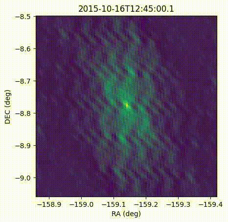
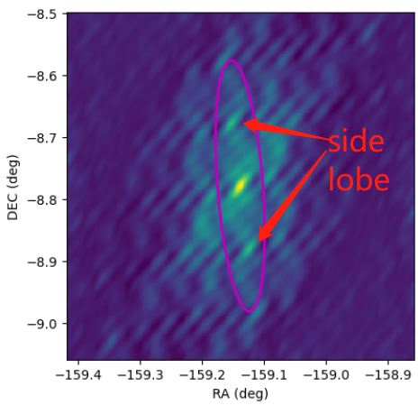
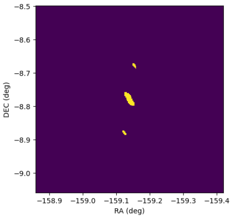
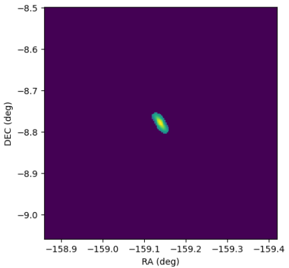
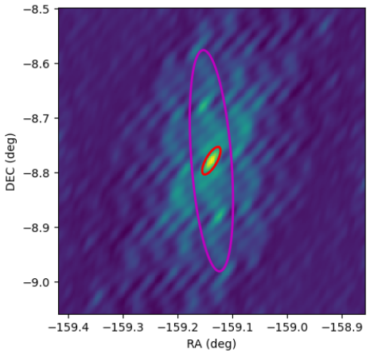

====================
Beam Beam Beam 
====================

For snapshot imaging with remote stations, (which is the most common imaging way for solar radio observations to resolve time domain variation), 
the uv coverage is usually sparse. As a result, the synthesized beam is usually irregular with significant side-lobes.
And the beam is varying with time due to the earth rotation:

Restoring beam shape
---------------------

Common procedure is to create PSF from UV configuration and restore beam from PSF, then use the beam to deconvolve the image.

By default, wsclean fit the PSF to a 3-parameter elliptic Gaussian function 
to get the restored-beam, but some times the fitting take the side-lobe into account, 
especially for snapshots with long baselines 
(sparse UV distribution creates irregular PSF).

there are several parameters to tweak when this happens:

1. ``-circular-beam`` : force the beam to be circular then the beam is highly elliptical (https://wsclean.readthedocs.io/en/latest/restoring_beam_size.html)
2. ``-theoretical-beam`` : use the theoretical beam instead of the fitted beam, usually used in inspections or quick imaging, not recommended for final image.
3. ``-beam-shape`` : input a beam shape as the restored-beam to do the convolution. (``useMyBeam`` in next section)

useMyBeam
---------

To have more flexibility, we can generate beam shape from the PSF with our own algorithm,
and use the beam shape to do the convolution.

Steps:

1. Create PSF with the same input parameter as the planed final image, but with the option ``-make-psf-only`` and ``-no-fit-beam``

.. code:: bash

     wsclean -mem 90 -no-reorder -no-update-model-required  -mgain 0.8 \
        -weight  briggs 0.5  -auto-mask 3 -auto-threshold 0.3 -size 934 934 \
        -scale 10.701100379915806asec -pol I -data-column CORRECTED_DATA \
        -interval 100 101 -intervals-out 1 -make-psf-only -no-fit-beam \
        -niter 1200 -name ./tmp/dummy path/to/MS

this command will create a PSF fits file at  ``./tmp/dummp-psf.fits``

2. use customized method to obtain a beam shape:

.. code:: bash

    pymsPSFfitPeakGauss ./tmp/dummy-psf.fits

this command returns something like:

.. code::

    59.572246348asec 24.846714688asec -148.7979535deg

3. use the beam shape to do the convolution:

.. code:: bash

     wsclean -mem 90 -no-reorder -no-update-model-required  -mgain 0.8 \
        -weight  briggs 0.5  -auto-mask 3 -auto-threshold 0.3 -size 934 934 \
        -scale 10.701100379915806asec -pol I -data-column CORRECTED_DATA \
        -interval 100 101 -intervals-out 1 -no-fit-beam \
        -beam-shape 59.572246348asec 24.846714688asec -148.7979535deg \
        -niter 1200 -name ./imgfits/IM path/to/MS

Algorithm used for beam shape determination
^^^^^^^^^^^^^^^^^^^^^^^^^^^^^^^^^^^^^^^^^^^

Threshold the PSF image the a ratio (e.g. 0.5) of the maximum value,

Select only the region covers the pixel of maximum. Fit Gaussian functions with the pixels inside.

Convert the fitted Gaussian parameters to the beam shape parameters. result:

and return to stdout a formated string as ``[bmaj]asec [bmin]asec [bpa]deg`` for ``-beam-shape`` option.

