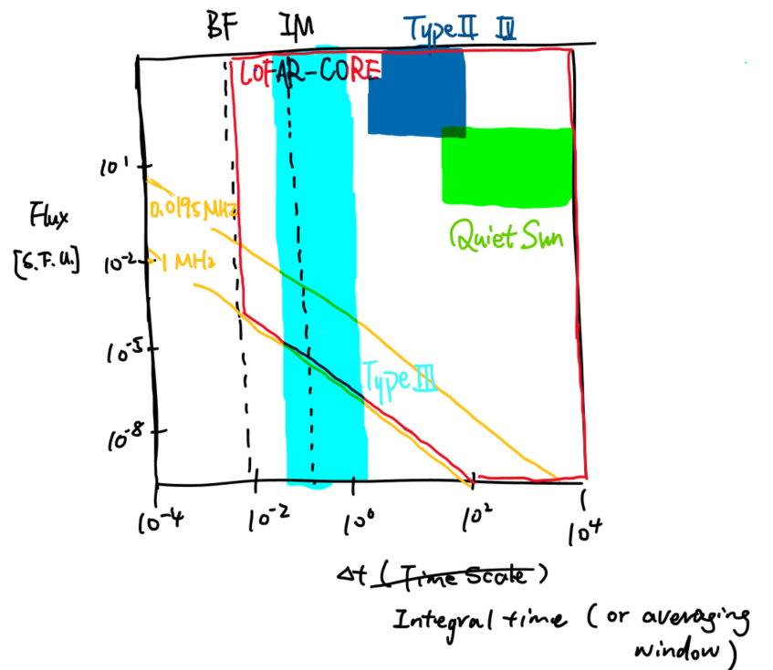

.. LOFAR-Sun documentation master file, created by
   sphinx-quickstart on Sun Jul  3 18:12:56 2022.
   You can adapt this file completely to your liking, but it should at least
   contain the root `toctree` directive.

Welcome to LOFAR-Sun's documentation!
=====================================

LOFAR data processing for Solar and Space Weather. 

Project git repository : `LOFAR-Sun-tools <https://github.com/peijin94/LOFAR-Sun-tools>`__

The LOw Frequency ARray (LOFAR) is a large-scale array of radio telescopes, it can perform multiple flexible type of observations, 
making it a great instrument for solar and space weather studys:

:Solar imaging:
   - **Interferometry imaging**, high spatial resolution (~ arcmin), low time resolution (>0.1s), low frequency resolution (~0.5 MHz).
   - **Tied array beam imaging**, high time resolution (1/96s), high frequency resolution (0.02 MHz), low spatial resolution (~ 0.4 Deg).

:Solar spectroscopy:
   - **Beamformed dynamic spectrum**, no spatial resolution,  high time resolution (1/96s), high frequency resolution (0.02 MHz).

:Heliosphere:
   - **Beamformed dynamic spectrum** of quasars, for interplanetary scintillation.
   - **Pulsar observations** for solar wind plasma and CMEs.

A brief overview of LOFAR-core sensitivity and time scale and interested science subjects:

The common data formats for solar and space weather studys:

-  (.MS) Interferometry raw data, measurement set.
   `interferometry <interferometry.html>`__
-  (.h5) Beamformed data, HDF5 format.
   `beamformed <beamformed.html>`__
-  (xxx-cube.fits) Beamformed data, fits
   cube.\ `beamformed <beamformed.html>`__
-  (xxx-image.fits) Interferometry image
   data.\ `interferometry <interferometry.html>`__

.. toctree::
   :maxdepth: 2
   :caption: Quick start
   :hidden:

   /install

.. toctree::
   :maxdepth: 2
   :caption: Interferometry
   :hidden:

   /interferometry

.. toctree::
   :maxdepth: 2
   :caption: Beamformed
   :hidden:

   /beamformed

   

.. toctree::
   :maxdepth: 2
   :caption: Executables
   :hidden:

   /cli

Cite as
-------

https://arxiv.org/abs/2205.00065

